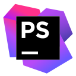

<h1 align="center">
  
</h1>

 

  

  <a href="https://github.com/arthurbertossi">
    
    

 
  

    

 
 

 **System**

   
   <a href="https://www.microsoft.com/" title="Windows11"> /></a>
 

 **Tools:**

<a href="https://code.visualstudio.com/" title="VSCode"> /></a>
<a href="https://www.jetbrains.com/pt-br/phpstorm/" title="PhpStorm"> /></a>
<a href="https://git-scm.com/" title="GiT"> /></a>
<a href="https://www.gimp.org/" title="GIMP"> /></a>
<a href="https://getcomposer.org/" title="Composer"> /></a>
<a href="https://www.docker.com/" title="Docker"> /></a>

 **Currently working with:**

<a href="https://www.w3.org/html/" title="HTML5"> /></a>
<a href="https://www.w3.org/Style/CSS/" title="CSS3"> /></a>
<a href="https://developer.mozilla.org/pt-BR/docs/Web/JavaScript" title="JavaScript"> /></a>
<a href="https://www.php.net/" title="PHP"> /></a>
<a href="https://nodejs.org/en" title="Node.js"> /></a>
<a href="https://www.mysql.com/" title="MySQL"> /></a>
<a href="https://discord.js.org/" title="Discord.js">
<a href="https://www.python.org/" title="Python"> /></a>
